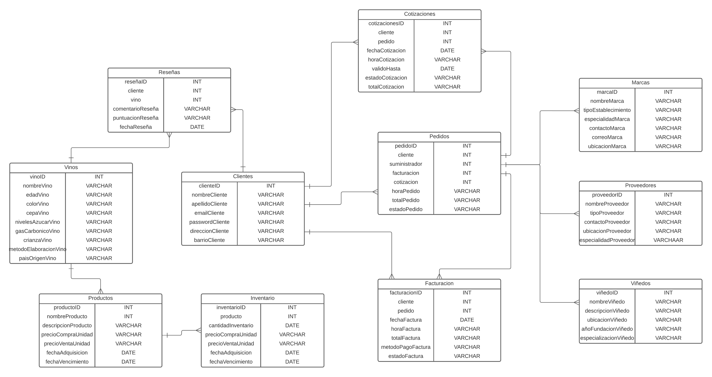

# Golden-Wines
 *¿Te interesaría una plataforma que facilite la conexión entre productores y compradores de vino, permitiéndote descubrir bodegas y etiquetas que quizás no conocías previamente?*

## Descripcion

Proyecto que permite que el cliente pueda conocer el mercado de vinos a tiempo real, las informaciones al respecto de cada uno de los productos, del sector de vinos, y sus distribuciones en todo el país, para acceder desde viñedos tradicionales hasta marcas expendedoras. 

## Links de referencia del proyecto

1. Speech para la presentación del proyecto, formulandolo con su problemática, justificación, alcances, obejtivos, entre otros:

        https://www.canva.com/design/DAFprwNn-UA/Uo2Z7nhxNJOVDybVsrORZA/view?utm_content=DAFprwNn-UA&utm_campaign=designshare&utm_medium=link&utm_source=publishsharelink

2. Figma para el diseño de prototipos de pantalla:

        https://www.figma.com/proto/i0xJ4bEziaeL0YvUfVRsqa/Golden-Wines?node-id=1-2&scaling=scale-down&mode=design&t=xuW4rxvZo8XLVy8Z-1

3. Diagrama de clases

        (Referenciado en esta documentación en su entidad)

## Objetivo general

Desarrollar un sistema que contenga toda la información de viñedos y sus productos con la proyección de que los amantes y consumidores de vino, tengan un sistema de simple acceso y entendimiento sobre todo tipo de información sobre productos, viñedos y marcas expendedoras cercanas con la finalidad de que estén seguros de sus compras.

## Objetivos especificos 

- Desarrollar un sistema de registro en línea que permita a los proveedores de vinos crear cuentas y completar perfiles con información detallada sobre sus empresas y productos.

- Construir una interfaz intuitiva que permita a los proveedores agregar y actualizar sus productos de vinos con detalles como nombre, descripción, tipo de uva, añada, región de origen y precios.

- Implementar un sistema de verificación de la autenticidad y calidad de los proveedores para garantizar la fiabilidad de la información proporcionada.

## Diagrama de entidad/relacion

### Tablas

**1. Clientes:**  La colección de "Clientes" almacena la información de los clientes interesados en conocer el mercado de vinos en tiempo real. Cada registro representa un cliente individual y contiene datos como nombre, apellido, dirección, correo electrónico, entre otros. Esta colección es esencial para la interacción con los usuarios y para brindarles una experiencia personalizada.

**2. Cotizaciones:** La colección de "Cotizaciones" registra las consultas realizadas por los clientes sobre los productos de vinos. Cada registro representa una cotización individual e incluye detalles como el cliente que solicitó la cotización, el total de la cotización, la fecha y hora de la solicitud y el estado actual de la cotización. Esta funcionalidad permite a los usuarios obtener información detallada sobre los vinos que desean adquirir.

**3. Facturaciones:** La colección de "Facturaciones" registra las transacciones de compra realizadas por los clientes. Cada registro representa una factura generada para una compra específica e incluye detalles como el cliente que realizó la compra, la fecha y hora de la transacción, el total de la factura y el método de pago utilizado. Esta colección es fundamental para llevar un registro detallado de las ventas y el estado de las facturas.

**4. Inventario:** La colección de "Inventario" contiene información sobre el stock de productos disponibles en el sistema. Cada registro representa un producto individual y contiene detalles como la cantidad en inventario, el precio de compra y venta, la fecha de adquisición y, opcionalmente, la fecha de vencimiento para productos con fecha de caducidad. Esta colección es esencial para gestionar el inventario de los productos de vinos.

**5. Marcas:** La colección de "Marcas" almacena información sobre las distintas marcas de vinos disponibles en el mercado. Cada registro representa una marca específica y contiene datos como el nombre, la descripción, el país de origen, el año de fundación y cualquier otra información relevante para identificar y distinguir las marcas expendedoras.

**6. Pedidos:** La colección de "Pedidos" registra las solicitudes de compra realizadas por los clientes. Cada registro representa un pedido individual e incluye detalles como el cliente que realizó el pedido, la fecha y hora del pedido, los productos solicitados y la cantidad de cada producto. Esta colección es crucial para gestionar y procesar las solicitudes de compra de los clientes.

**7. Productos:** La colección de "Productos" contiene información detallada sobre los distintos productos de vinos disponibles en el mercado. Cada registro representa un producto específico y contiene características como el nombre, la descripción, el tipo de vino, el país de origen, el tipo de uva, el precio de venta y cualquier otra información relevante para describir y clasificar los productos de vinos.

**8. Proveedores:** La colección de "Proveedores" almacena información sobre los proveedores que suministran los productos de vinos. Cada registro representa un proveedor individual y contiene datos como el nombre, la dirección, el país, el teléfono de contacto y el correo electrónico de contacto. Esta colección es fundamental para mantener una relación actualizada con los proveedores y gestionar el abastecimiento de productos.

**9. Reseñas:** La colección de "Reseñas" registra las opiniones y valoraciones de los clientes sobre los productos de vinos. Cada registro representa una reseña individual y contiene detalles como el cliente que realizó la reseña, el vino evaluado, el comentario sobre el vino, la puntuación otorgada y la fecha de la reseña. Esta colección permite a los usuarios compartir sus experiencias y proporciona información valiosa para otros clientes interesados en los vinos.

**10. Viñedos:** La colección de "Viñedos" almacena información sobre los viñedos que producen los vinos disponibles en el mercado. Cada registro representa un viñedo específico y contiene datos como el nombre, la ubicación, el año de fundación y cualquier otra información relevante para identificar y distinguir los viñedos tradicionales que participan en la producción de los vinos.

**11. Vinos:** La colección de "Vinos" contiene información detallada sobre los distintos productos de vinos disponibles en el mercado. Cada registro representa un vino específico y contiene características como el nombre, el tipo de vino, el país de origen, los niveles de azucar, la cepa, entre otros. Esta colección es esencial para brindar a los usuarios una visión completa y detallada de cada vino disponible.